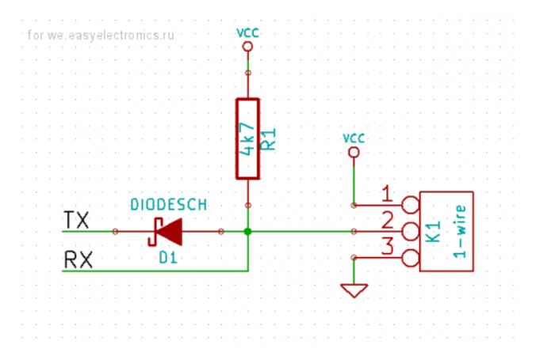

# DS18B20 UART 1-Wire Driver for STM32 (HAL)

This is a non-blocking(RTOS ready), UART-based 1-Wire driver for the DS18B20 temperature sensor family, written for STM32 using the HAL library.

Instead of bit-banging a GPIO, this driver uses a UART to generate the 1-Wire timing, and supports all ROM commands (Search, Match, Alarm Search, etc.) and all function commands (Convert T, Read/Write Scratchpad, Copy, Recall, Read Power Supply).

For a deeper understanding of why a UART can emulate 1-Wire communication, see:\
**Zilog AN0346 — Using a UART to Implement a 1-Wire Bus**: [https://www.zilog.com/docs/appnotes/AN0346.pdf](https://www.zilog.com/docs/appnotes/AN0346.pdf)

---

## Features

- STM32 HAL-based, written in C++
- Uses UART (interrupt / DMA) to emulate 1-Wire timing
- Non-blocking, state-machine based API
- Supports all DS18B20 ROM and Function commands
- Helper utilities: temperature parsing, TH/TL, resolution detection, printable strings

Internally, the driver uses a small static registry to map `UART_HandleTypeDef*` to DS18B20 instances (supported upto 4 Uarts ). This ensures that HAL UART callbacks are dispatched to the correct object.

> Some DS18B20 functions such as `SkipRom()` do not have a `Process_` variant. the next operation after these functions must wait for the UART to become free, typically using a do-while loop that checks for `D_Status::BUSY`. function after `Process_MatchROM()` should aslo be called this way.

> the recomended way of calling a function is `do(func) -> while(D_Status::BUSY)`.

> **Important:** The driver assumes exclusive control over the UART. It dynamically reconfigures the baudrate (9600 for reset, 115200 for commands). Do not share this UART with other modules.

---

## Supported MCUs / Dependencies

- Any STM32 MCU with HAL (tested on STM32F4)
- C++ compiler
- UART configured in STM32CubeMX
- The DS18B20.h file include "main.h" which make this Lib universal to all platform of STM32 MCUs

---

## Usage Notes

Include examples of initialization, ROM search, scratchpad reading, and decoding temperature as needed.

---

## License

MIT License (Add LICENSE file in repo).

---

## Hardware Wiring and Pin Configuration

Below is the recommended hardware connection for using a UART peripheral to emulate a 1-Wire bus. The TX pin drives the bus through a diode, while the RX pin reads the bus directly. A 4.7 kΩ pull-up resistor is required on the 1-Wire line.

### Circuit Diagram

### Required CubeMX Pin Configuration

For the **TX GPIO pin** assigned to the selected UART instance, it is **mandatory** to configure the pin as:

- **Alternate Function**
- **Output Type: Open-Drain** (VERY IMPORTANT)

This ensures that the TX pin can release the bus (high‑impedance) during read slots so the DS18B20 can pull the line low.

For the **RX GPIO pin**, configure normally as:

- Alternate Function UART RX
- Input mode (Default)

### Pull-up Resistor Requirement

The 1-Wire bus **must** have a pull-up resistor:

- Recommended value: **4.7 kΩ**
- Connected between **DQ** and **VCC**

### Summary of Electrical Behavior

- TX drives the line low through the diode → safe, unidirectional pull-down
- TX releases (open-drain mode) → bus floats high via pull-up
- RX monitors the bus level directly
- DS18B20 can pull the line low during read time slots

This hardware configuration is essential for correct 1-Wire operation when using UART-based signaling.
